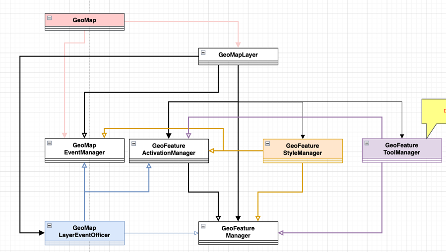

# GeoMap2


# 개요
구글 지도기반의 지도 편집 시스템을 개발하면서 정책에 따라 데이터들을 분류하고 기능에 따라 분리하였습니다.

# 정책
기획에 따라 데이터 종류와 기능들을 분리하였으며 이러한 데이터들이 가지고 있는 속성과 기획의 조건들을 바탕으로 플래그를 만듭니다.
이러한 플래그는 각 데이터의 종류에 따라 지정되어 있으며 플래그에 따라 기능이 다르게 동작합니다. 예) isDragEnableNode 정책 플래그가 true 이면 GeoNode는 setDraggable true로 변경합니다.
정책 플래그가 수정되면 해당 정책 플래그에 맞게 상태가 변경됩니다. 
```ts

```

# 데이터
맵: GeoMap2 - 구글 맵의 빈공간으로서 지도 이미지, 지도 회전, 지도 이동등 지도를 컨트롤 하는 기능을 제공하며 지도의 기본 설정을 제어할 수 있습니다. 지도에 추가되는 다양한 재료들을 feature라고 합니다.

레이어: GeoLayer - 구글 맵에 그려지는 feature들의 모음이지만 여러 레이어로 나뉠 수 있습니다. 하나의 레이어에 해당하며 레이어에 들어있는 feature들의 정책을 제어 합니다.
길: GeoWay - globalPath는 geoJson 데이터로 주어집니다. 이때 Feature 중 LineString에 해당하는 부분입니다. LineSegment들로 이뤄지며 길의 속성과 동작을 제어하는 기능들을 제공합니다. 
선: GeoLineSegment - 두개의 점으로 이뤄집니다. 길이는 항상 1이며 이러한 선이 모여 길을 이룹니다.    
점: GeoNode - globalPath의 Feature중 Point에 해당합니다. 점의 속성과 동작을 제어하는 기능들을 제공합니다. 점과 길이 연결된 형태에 따라 여러 타입으로 구분됩니다.
예비점: GeoNode( -> GeoPreNode로 변경될 예정) - 실제 있는 데이터는 아니지만 선 의 중앙에 위치하며 클릭하면 점이 생성되어 데이터에 추가됩니다.

# 기능
각 geoJson 데이터들은 위와 같은 class들로 모델링됩니다. 이렇게 만들어진 모델들을 usecase에 맞게 동작을 시키는 책임을 가지도록 분류하였습니다.
구글맵은 map - (맵), marker - (점, 예비점)에 대한 이벤트, polyline - (선, 길)에 대한 이벤트를 제공합니다. 
이러한 이벤트에서 제공하는 데이터들과 usecase에 의해 필요한 이벤트들이 추가되어 데이터들을 원하는 타이밍에 주고 받으며 기능을 동작시킵니다.   

## 이벤트
EventListenerManager 
- 이벤트는 특정한 상황이 발생했다는 신호를 데이터와 함께 전달해줄 수 있는 방식입니다. 이와 같은 상황이 필요하다면 이벤트를 정의하고 
발생시켜 데이터를 원하는 타이밍에 전달합니다.

EventPreventer
- 이벤트들의 특성에 따라 bubbling되면서 서로 영향을 미칠수 있습니다. 이러한 현상을 차단합니다. 
- 버블링이 되는 특성에 따라 한번만 prevent 할지, 일정 시간내에 발생한 이벤트는 모두 prevent 할지 설정하여 이벤트 발생을 제어할 수 있습니다.

## 기능의 분류

### 멥의 기능
GeoMap2 - 맵을 컨트롤하는 기본기능들을 제공합니다.
  - 맵의 이벤트 제어: GeoMapEventManager가 맵의 기능에 필요한 이벤트들을 제어하는 기능을 제공하여 GeoMap에 제공합니다.
  - GeoMapLayer의 범위에서 맵을 제어해야할 수 있습니다. 따라서 GeoMapEventManager는 GeoMap에서 생성되나 레이어까지 참조 됩니다.
### 레이어의 기능
아래 각 매니저들은 서로의 데이터들을 참조 할 수 있습니다. 이를 위해 Layer에서 매니저들을 생성할 때 생성자에 참조할 매니저들을 전달합니다. 필요한 데이터들은 매니저들 끼리 이벤트를 통해서 전달합니다. (실제 발생한 타이밍에 전달되는 데이터가 반영되어야 하기에) 
GeoLayer - 모드에 따라 정책들을 설정하여 정책에 따라 레이어의 상태를 제어합니다. 즉, 정책이 바뀌면 해당 정책에 따라 레이어의 상태가 변경됩니다.
  - GeoFeatureActivationManager - 정책상 feature들이 활성화되거나 비활성화 되는 형태로 나눠집니다. 활성화 관련 기능들이 모여있스빈다. 각 feature들을 활성화 시키거나 비활성화 시킬수 있으며 이러한 타이밍에 맞게 이벤트를 발생시켜 활성화된 데이터들의 정보들을 전파할 수 있습니다. 사용자가 이러한 feature들을 활성화 시키는 기능들도 제공합니다.
  - GeoFeatureStyleManager - feature들의 모양을 다룹니다. 모양을 결정짓는 요소들을 정책으로 받아 적용하며 각 feature들을 현재 레이어의 상태에 따라 모양을 바꿔줍니다.  
  - GeoFeatureToolManager - usecase에서 사용자들이 레이어의 모드와 사용자 인터렉션에 따라 도구모음을 노출시킵니다. 사용자 인터렉션에 따른 노출여부와 위치를 조절합니다. 이러한 도구들을 레이어의 상태에 따라 제공하고 도구를 클릭했을 때의 이벤트를 제공합니다.
  - GeoFeatureManager - 분류된 데이터들을 내부적인 자료구조로 변환하면서 feature로 바꿔 저장합니다. 이러한 자료구조를 이용해 feature들을 CRUD를 합니다. CRUD 발생시 이벤트를 제공합니다. 이외 feature들의 위치도 관리합니다.
  - GeoLayerEventOfficer - 레이어의 usecase중 위 매니저들로 분리되지 않은 기능들이 들어갑니다.(예: draggable, clickable등) 그리고 매니저들을 사용해서 실제 사용자의 usecase들을 기능으로 정의하고 등록합니다.

# Convention
## 캡슐화
- 각 class별로 자신의 은닉성을 위해서 private을 사용하여 외부로 공개되지 않는다면 인터페이스를 숨깁니다.
- class에서 사용되는 객체들은 직접 그객체를 외부로 제공하지 않고 필요한 객체의 데이터들을 가공하는 함수를 제공하거나, 내부적으로 사용할 때도 private한 member변수를 정의히여 사용합니다.  
    ```ts
      // GeoNode 
      setDraggable = (draggable: boolean) => {
        if (this.isDraggable() == draggable) return
        this._draggbale = draggable
        this._marker.gmpDraggable = draggable
        this._updateMarkerCursor()
        this.eventManager.invokeDraggableChangeEventListener(draggable)
      }
      
      isDraggable = () => this._draggbale
    ```

- 데이터의 전달
  - 모드가 변경되면 정책이 변경됩니다. 정책이 변경되면 해당 정책에 맞게 해당 레이어의 상태가 변경됩니다.
  - 사용자의 인터렉션에 따라 이벤트가 발생하며 이러한 이벤트에 전달되는 데이터들을 통해서 서로 참조할 데이터들을 업데이트 합니다.
    ```ts
    // GeoFeatureStyleManager 의 생성자에서 ... 
    this._mapEventManager.addMapTypeChangeStickyEventListener((mapType: GeoMapTypeEnum) => {
      this._mapType = mapType
      this._featureManager.getAllWays().forEach((way) => {
      this._updateWayStyle(way, this._featureActivationManager.isWayActivated(way), this._mapType)
     })
    })
    ```


